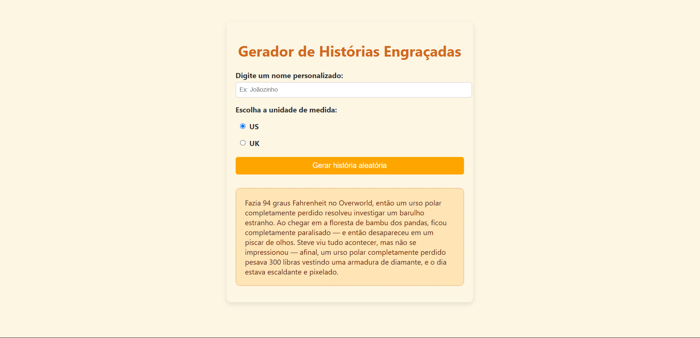

# Gerador de Histórias Engraçadas 🎩✨

Um projeto simples que gera histórias humorísticas aleatórias com base em entradas do usuário. Perfecto para praticar JavaScript e DOM manipulation!

## Funcionalidades 🚀

- Campo para inserir nome personalizado
- Escolha entre unidades de medida US ou UK
- Botão para gerar histórias aleatórias

## Como Usar 🖱️

1. Clone o repositório:
```bash
git clone https://github.com/seu-usuario/gerador-historias.git
```

2. Abra o arquivo `index.html` no navegador

3. Preencha os campos:
   - Digite um nome qualquer
   - Selecione o sistema de medidas
   - Clique em "Gerar história aleatória"

4. Divirta-se com as histórias malucas! 🤪

## Tecnologias Utilizadas 💻


## Estrutura do Projeto 📂

```
.
├── index.html
├── main.js
└── README.md
```

## Pré-visualização 🖼️



---

Feito com ☕ por [Hugo Moraes](https://github.com/HugMoraes)

